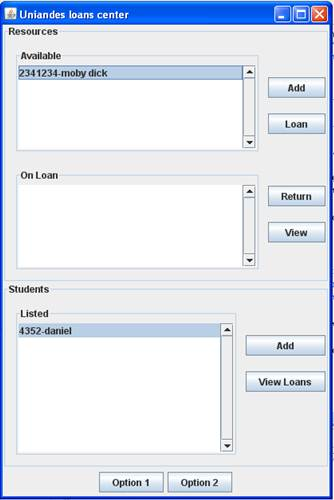

# Problem Description

We want to build an application for the university loans center that handles all
the loans of the resources that the universiti has available for its students.

The resources can be anything. They are identified by a unique id and a name. 
An example is a "guitar" with id "10". The id's are unique but the names can be
repeated. Every resource that is to be loaned to a student must first be registered
in the application. A resource can be loaned as long as it is available, meaning
it hasn't been loaned to any other student.

A student is identified by a unique id number and a non unique name. if a student
wants to borrow any of the universitiy resources, he/she must be registered.
Otherwise they will not be allowed to borrow a resource.

The application must do the following tasks:

(1) Add a resource to the loans center, (2) Add a student to the loans center,
(3) loan an available resource to a student, (4) register the returning of a
resource from a student, (5) check what student has a resource on loan and (6)
check what resources a student has on loan.

When adding new elements to the lists, there is no need to maintain any order.
The elements are added at the end of the list.

# Graphical User Interface

